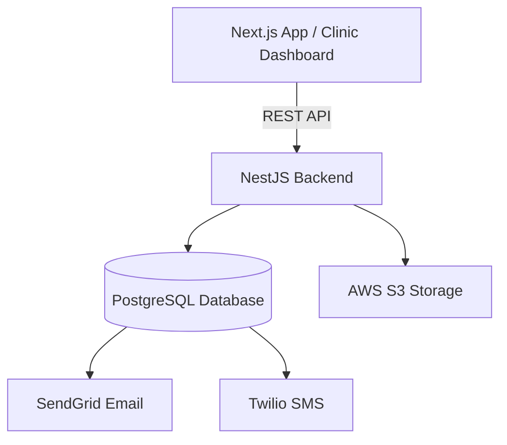

# System Architecture - Frigo Labs MVP

## Description

- **Frontend**: Next.js application providing the Clinic and Admin dashboards.
- **Backend**: NestJS framework handling business logic, authentication, and integration.
- **Database**: PostgreSQL (via Supabase) for transactional data.
- **Storage**: AWS S3 for lab result PDFs and other attachments.
- **Email**: SendGrid for transactional email notifications.
- **SMS**: Twilio for text message notifications.
